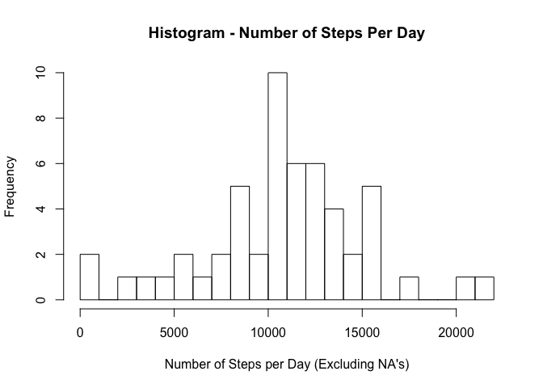
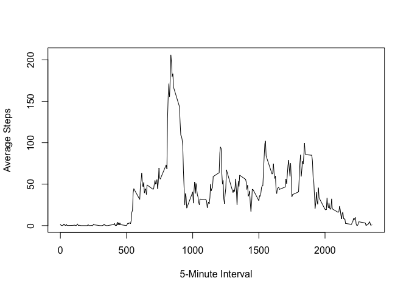
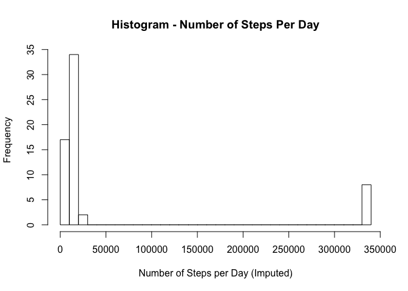

# Reproducible Research: Peer Assessment 1

Prepared by: Bob Graves

This analysis examines data from a personal activity monitoring device, which samples at 5 minute intervals through out the day. The data consists of two months of data from an anonymous individual collected during the months of October and November, 2012.

## Loading and preprocessing the data

The data for this project resides in a file named "activity.csv". 
The following R code reads the raw data and transforms the dates into "rawActivity", 
which has some NA values, which are indicated in the summary of the data.

```r
rawActivity<-read.csv("activity.csv")
rawActivity$date <- as.Date(rawActivity$date,"%Y-%m-%d")

summary(rawActivity)
```

```
##      steps             date               interval     
##  Min.   :  0.00   Min.   :2012-10-01   Min.   :   0.0  
##  1st Qu.:  0.00   1st Qu.:2012-10-16   1st Qu.: 588.8  
##  Median :  0.00   Median :2012-10-31   Median :1177.5  
##  Mean   : 37.38   Mean   :2012-10-31   Mean   :1177.5  
##  3rd Qu.: 12.00   3rd Qu.:2012-11-15   3rd Qu.:1766.2  
##  Max.   :806.00   Max.   :2012-11-30   Max.   :2355.0  
##  NA's   :2304
```
Next, the data are cleaned by removing the NA rows, resulting in the data frame "cleanActivity".

```r
c <- complete.cases(rawActivity)
cleanActivity <- rawActivity[c,]
```


## What is mean total number of steps taken per day?

To address the mean total number of steps taken per day, we total the number of steps with
the rowsum() function, and illustrate with a histogram. We see a dominant number of steps just over 10000.


```r
cleanStepsPerDay<-rowsum(cleanActivity$steps,format(cleanActivity$date,"%Y-%m-%d"))
hist(cleanStepsPerDay,breaks=25,xlab="Number of Steps per Day (Excluding NA's)",main = "Histogram - Number of Steps Per Day")
```

 
Analyzing the data we find:

```r
meanTotalStepsPerDay <- sprintf(fmt="%6.1f",mean(cleanStepsPerDay))
medianTotalStepsPerDay <- sprintf(fmt="%6.1f",median(cleanStepsPerDay))
```

The mean total steps per day is 10766.2.

The media total steps per day is 10765.0.

## What is the average daily activity pattern?

The average daily activity pattern is determined by taking each 5-minute interval 
and averaging the number of steps taken across all days. This tells us when in a day we might expect the most activity. A plot of the daily activity pattern follows.

```r
avgStepsPerInterval<-aggregate(steps ~ interval, data=cleanActivity, FUN=mean)

plot(avgStepsPerInterval, type="l",xlab="5-Minute Interval",ylab="Average Steps")
```

 

Anylyzing the plot, we note the maximum average number of steps is around interval 800 (estimate).
Following, we select the actual maximum:

```r
maxSteps<-subset(avgStepsPerInterval,avgStepsPerInterval$steps==max(avgStepsPerInterval$steps))
maxSteps
```

```
##     interval    steps
## 104      835 206.1698
```
Reviewing the plot, we notice features that emphasize a work-day pattern: A large number of steps are around the start-of the typical workday (0800-0900 intervals). There are local maxima around lunchtime (1100), afternoon (1530), and close-of-business (1700-1800). All of these inflections in the data reinforce a basic intuition of work-day patterns.

## Imputing missing values
The raw (i.e. CSV) data in our activity dataset has a number of NA values:

```r
sum(is.na(rawActivity[,'steps']))
```

```
## [1] 2304
```

To fix (impute) the data, we estimate missing values of the number of steps for any given interval to be the average number of steps for that interval for the entire data set. The following R code transforms the rawActivity into imputedActivity by replacing steps that have NA values with the average steps for that interval. We use the variable name "imputed" in this corrected data set. 


```r
imputedActivity <- rawActivity

numFixed<-0
for(i in 1:nrow(rawActivity)) {
    if(is.na(rawActivity[i,'steps'])) {
        interval<-activity[i,'interval']
        imputedActivity[i,'steps'] <- avgStepsPerInterval[avgStepsPerInterval$interval==interval,'steps']
# test  imputedActivity[i,'steps'] <- avgStepsPerInterval[avgStepsPerInterval$interval==interval,'steps'] + 200
# test  imputedActivity[i,'steps'] <-5*interval
        numFixed<-numFixed+1
    }
}

#print(numFixed)
```

We repeat the computation of the average number of steps for each interval, this time using the imputedActivity and displaying a histogram  of the [imputed] average steps per day. 

```r
avgImputedStepsPerInterval<-aggregate(steps ~ interval, data=imputedActivity, FUN=mean)
# plot(avgImputedStepsPerInterval, type="l",xlab="5-Minute Interval",ylab="Average Steps (Imputed)")

# print(head(imputedActivity))
imputedStepsPerDay<-rowsum(imputedActivity$steps,format(imputedActivity$date,"%Y-%m-%d"))
hist(imputedStepsPerDay,breaks=25,xlab="Number of Steps per Day (Imputed)",main = "Histogram - Number of Steps Per Day")
```

 

```r
print(nrow(imputedStepsPerDay))
```

```
## [1] 61
```

The mean and median of the imputedActivity data follow:

```r
mean(imputedStepsPerDay)
```

```
## [1] 10766.19
```

```r
median(imputedStepsPerDay)
```

```
## [1] 10766.19
```

## Are there differences in activity patterns between weekdays and weekends?
To compare differences in weekday and weekend activity, we segregate the imputed activity data using a "weekday" factor. The value "weekday" indicates Monday-Friday activity, whereas "weekend" indicates Saturday-Sunday activity. 

```r
weekend<-c("Saturday","Sunday")

isWeekend <- weekdays(imputedActivity$date) %in% weekend
imputedActivity$weekday<-factor(isWeekend,c(FALSE,TRUE),labels=c("weekday","weekend"))
```
To illustrate the differences in weekday and weekend activity, we examine the panel plot of weekend and weekday activity versus interval. We note a similar start-of-day increase of steps, but activity patterns during the day are different. Both plots exhibit fewer steps in the typical nighttime range of intervals (2200-0500). 

```r
library(lattice)
avgStepsPerInterval<-aggregate(steps ~ interval+weekday , data=imputedActivity, FUN=mean)
panel<-xyplot(steps ~ interval | weekday, data=avgStepsPerInterval, layout=c(1,2),type='l')
print(panel)
```

 

Footnote:
This assignment makes use of data from a personal activity monitoring device. This device collects data at 5 minute intervals through out the day. The data consists of two months of data from an anonymous individual collected during the months of October and November, 2012 and include the number of steps taken in 5 minute intervals each day.
The source of this data at the time of this report: https://d396qusza40orc.cloudfront.net/repdata%2Fdata%2Factivity.zip
