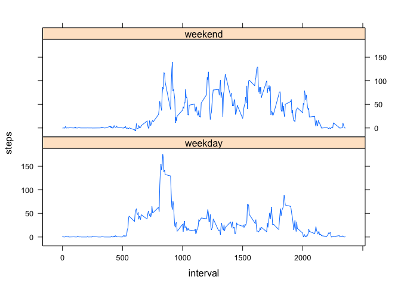

# Reproducible Research: Peer Assessment 1


## Loading and preprocessing the data

The data for this project resides in a file named "activity.csv". 
The following R code reads the raw data and transforms the dates into "rawActivity", 
which has some NA values, which are indicated in the summary of the data.

```r
rawActivity<-read.csv("activity.csv")
rawActivity$date <- as.Date(rawActivity$date,"%Y-%m-%d")

summary(rawActivity)
```

```
##      steps             date               interval     
##  Min.   :  0.00   Min.   :2012-10-01   Min.   :   0.0  
##  1st Qu.:  0.00   1st Qu.:2012-10-16   1st Qu.: 588.8  
##  Median :  0.00   Median :2012-10-31   Median :1177.5  
##  Mean   : 37.38   Mean   :2012-10-31   Mean   :1177.5  
##  3rd Qu.: 12.00   3rd Qu.:2012-11-15   3rd Qu.:1766.2  
##  Max.   :806.00   Max.   :2012-11-30   Max.   :2355.0  
##  NA's   :2304
```
Next, the data are cleaned by removing the NA rows, resulting in the data frame "cleanActivity".

```r
c <- complete.cases(rawActivity)
cleanActivity <- rawActivity[c,]
```


## What is mean total number of steps taken per day?

To address the mean total number of steps taken per day, we total the number of steps with
the rowsum() function, and illustrate with a histogram.


```r
cleanStepsPerDay<-rowsum(cleanActivity$steps,format(cleanActivity$date,"%Y-%m-%d"))
hist(cleanStepsPerDay,breaks=25,xlab="Number of Steps per Day (Excluding NA's)",main = "Histogram - Number of Steps Per Day")
```

 


```r
meanTotalStepsPerDay <- sprintf(fmt="%6.1f",mean(cleanStepsPerDay))
medianTotalStepsPerDay <- sprintf(fmt="%6.1f",median(cleanStepsPerDay))
```

The mean total steps per day is 10766.2.

The media total steps per day is 10765.0.

## What is the average daily activity pattern?

The average daily activity pattern is determined by taking each 5-minute interval 
and averaging the number of steps taken across all days. A plot of the daily activity pattern follows.

```r
avgStepsPerInterval<-aggregate(steps ~ interval, data=cleanActivity, FUN=mean)

plot(avgStepsPerInterval, type="l",xlab="Interval",ylab="Average Steps")
```

 

Anylyzing the plot, we note the maximum average number of steps is around interval 800 (estimate).
Following, we select the actual maximum:

```r
maxSteps<-subset(avgStepsPerInterval,avgStepsPerInterval$steps==max(avgStepsPerInterval$steps))
maxSteps
```

```
##     interval    steps
## 104      835 206.1698
```

## Imputing missing values
The raw (i.e. CSV) data in our activity dataset has a number of NA values:

```r
sum(is.na(rawActivity[,'steps']))
```

```
## [1] 2304
```

To fix (impute) the data, we estimate missing values of the number of steps for any given interval to be the average number of steps for that interval for the entire data set. The following R code transforms the rawActivity to imputedActivity by replacing steps with NA values with the average steps for that interval. The result displayed after the loop is the number of fixed data points, which is equal to the number of NA's.


```r
imputedActivity <- rawActivity

numFixed<-0
for(i in 1:nrow(rawActivity)) {
    if(is.na(rawActivity[i,'steps'])) {
        interval<-activity[i,'interval']
        imputedActivity[i,'steps'] <- avgStepsPerInterval[avgStepsPerInterval$interval==interval,'steps']
        imputedActivity[i,'steps'] <- interval
        numFixed<-numFixed+1
    }
}

print(numFixed)
```

```
## [1] 2304
```

We repeat the computation of the average number of steps for each interval, this time using the imputedActivity and displaying a histogram to of the average steps per day. 

```r
avgStepsPerInterval<-aggregate(steps ~ interval, data=imputedActivity, FUN=mean)

# print(head(imputedActivity))
imputedStepsPerDay<-rowsum(imputedActivity$steps,format(imputedActivity$date,"%Y-%m-%d"))

hist(imputedStepsPerDay,breaks=25,xlab="Number of Steps per Day (Imputed)",main = "Histogram - Number of Steps Per Day")
```

 

```r
print(nrow(imputedStepsPerDay))
```

```
## [1] 61
```

The mean, median, and summary of the imputedActivity data follow:

```r
mean(imputedStepsPerDay)
```

```
## [1] 53828.98
```

```r
median(imputedStepsPerDay)
```

```
## [1] 11458
```

```r
summary(imputedStepsPerDay)
```

```
##        V1        
##  Min.   :    41  
##  1st Qu.:  9819  
##  Median : 11458  
##  Mean   : 53829  
##  3rd Qu.: 15084  
##  Max.   :339120
```


## Are there differences in activity patterns between weekdays and weekends?

```r
weekend<-c("Saturday","Sunday")

isWeekend <- weekdays(imputedActivity$date) %in% weekend
imputedActivity$weekday<-factor(isWeekend,c(FALSE,TRUE),labels=c("weekday","weekend"))
library(lattice)
avgStepsPerInterval<-aggregate(steps ~ interval+weekday , data=imputedActivity, FUN=mean)
panel<-xyplot(steps ~ interval | weekday, data=avgStepsPerInterval, layout=c(1,2),type='l')
print(panel)
```

 
